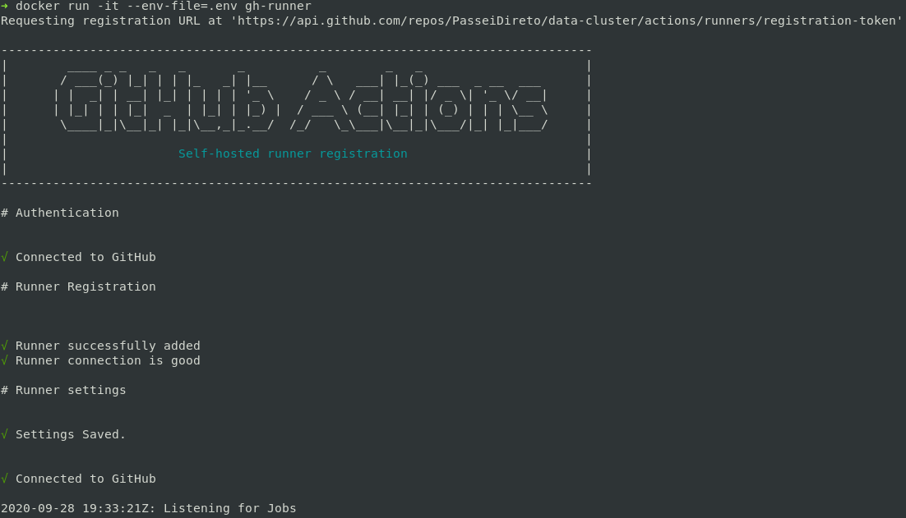
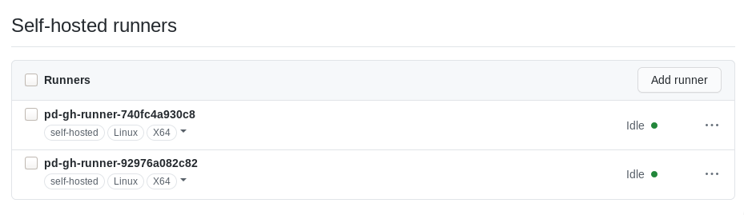
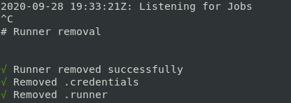
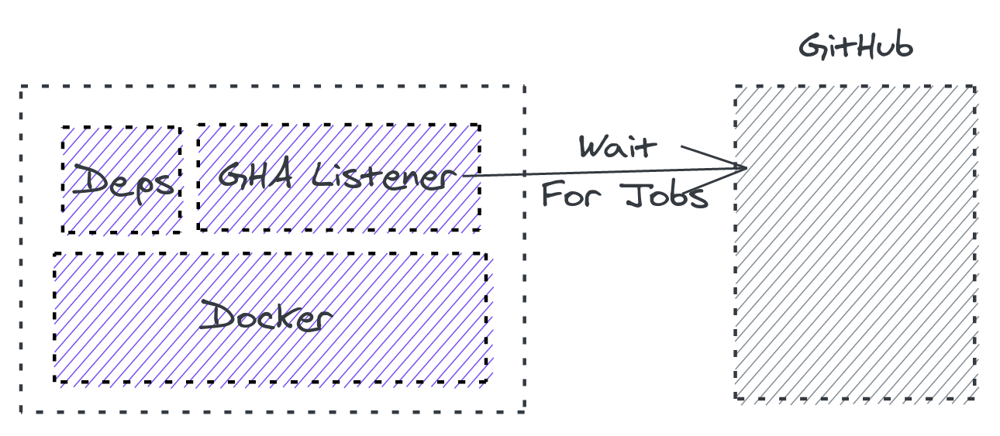

# GitHub Actions Runner

Self hosted GitHub Actions Runner.

GitHub Actions allows you to [host your own runners for actions](https://docs.github.com/en/free-pro-team@latest/actions/hosting-your-own-runners/about-self-hosted-runners). This project presents a docker container capable of setup, run and [register](https://docs.github.com/en/free-pro-team@latest/actions/hosting-your-own-runners/adding-self-hosted-runners) itself on a Organization or Repository, being available to execute workflows.

This image is available public at [Docker Hub](https://hub.docker.com/r/passeidireto/gh-runner). To run it, you just need to:

```
cp .env-exemple .env # modify with your custom configuration, such as the PAT, Repostitory and Organization.

docker run --name=gh-runner --rm  --privileged --env-file=.envpasseidireto/gh-runner
```

Just wait while it registers itself. You will see this output shortly:



You can also see the runner registered at the repository on `repo > settings > actions`:



After you kill the container (with ctrl+C or `docker stop gh-runner`) you will see as it deregisters itself and stops:



Note that it won't be able to unregisters nicely if you `docker kill` it or somehow send a `SIGKILL`.

If you want it registered at organization level, just let the `GITHUB_REPOSITORY` variable empty. See more about configuration variables at [Environment Variables](#environment-variables) section.  Also, keep in mind that you will need organization privilege levels to perform this action. More details are provided at [Personal Access Token (PAT)](#personal-access-token-pat).


## Features
1. You can set arbitrary names and register at organization or repository level
1. The runner executes just one workflow and then it stops and unregisters itself
1. You can have multiple runners in the same host
1. Docker in a Docker (Dind)
1. ECS and Kubernetes Ready
1. [Label](https://docs.github.com/en/free-pro-team@latest/actions/hosting-your-own-runners/using-labels-with-self-hosted-runners) customization


## Personal Access Token (PAT)

The following scopes are necessary in order to register a runner at organization level:

- `admin:org`

The following scopes are necessary in order to register at repository level:

- `repo` (all)
- `read:public_key` (on `admin:public_key`)
- `read:repo_hook` (on `admin:repo_hook`)
- `admin:org_hook`
- `notifications`
- `workflow`

## Environment Variables

| Name | Description |
|----------|-----------|
|RUNNER_NAME| Runner name. A random suffix will be generated to assert the uniqueness |
|GITHUB_PERSONAL_TOKEN| yours (or bot's) [PAT](https://docs.github.com/en/free-pro-team@latest/github/authenticating-to-github/creating-a-personal-access-token)|
|GITHUB_OWNER|Organization's name (e.g. PasseiDireto).|
|GITHUB_REPOSITORY| Repository's name (optional).|
|RUNNER_LABELS| Comma separated list of [labels](https://docs.github.com/en/free-pro-team@latest/actions/hosting-your-own-runners/using-labels-with-self-hosted-runners). They will be passed to runner on setup time.|

## Implementation details

The image has three basic components: the docker engine, runner dependencies and the runner listener:



This image runs a pattern known as Docker in Docker or Dind for short. There's a [official Dind Image](https://hub.docker.com/_/docker/), but it is only [Alpine compatible](https://github.com/docker-library/docker/issues/127). In the meanwhile, [GHA Runner](https://github.com/actions/runner/) only supports [other distributions](https://github.com/actions/runner/blob/main/docs/start/envlinux.md#supported-distributions-and-versions). That's why we have this image inspired on the official Dind, but based on [another initiative ](https://hub.docker.com/r/teracy/ubuntu) with [similar needs](http://blog.teracy.com/2017/09/11/how-to-use-docker-in-docker-dind-and-docker-outside-of-docker-dood-for-local-ci-testing/).

Users of this approach should bear in mind that technically the GHA Runner does not even support container execution, although that's something they (and the community) want and are [working into](https://github.com/actions/runner/labels/Runner%20%3Aheart%3A%20Container).

Another quirk of this approach is that we patched a small portion of the runner using some of the [maintainers tips](https://github.com/actions/runner/issues/246#issuecomment-568638572) to refrain the runner of trying to self update. Since the original update behavior is slow and restarts the listener, our container would be in a endless loop of starting and killing itself. That's why we use a custom `runsvc.sh` to run the listener. You can see the altered files the `/patched` repository.

Finally, we use [dumb-init](https://engineeringblog.yelp.com/2016/01/dumb-init-an-init-for-docker.html) to manage the service execution. The most important feature is to deal with the `SIGINT/SIGKILL` signals and [how docker reacts to them](https://www.ctl.io/developers/blog/post/gracefully-stopping-docker-containers/). With this approach we properly stop and unregister the listener in most of the scenarios, such as scale in and out, to work with platforms like (ECS/Fargate/EC2) and Kubernetes. Otherwise, the runner would hang forever as Offline on the repository/organization.

### Container's Lifecycle

We can resume the container's lifecycle as:

- Init (`docker run`)
- Authentication ( With the PAT and receiving a runner token)
- Runner repo/organization registration
- Waiting for taks (as long as needed)
- Workflow execution
- Interruption (`docker stop` or workflow conclusion )
    - Listener stop
    - Unsregisters the container (using a new runner token, as the old one [might be expired for long running tasks](https://github.com/actions/runner/issues/845))
- Container removal

## Inspirations

Some projects are trying to fill the lack of a official GHA Self Hosted Runners for containers and ephemeral approaches, such as ECS and Kubernetes. We can list some of them:

- https://github.com/myoung34/docker-github-actions-runner
- https://github.com/summerwind/actions-runner-controller
- https://dev.to/jimmydqv/github-self-hosted-runners-in-aws-part-1-fargate-39hi
- https://github.com/evryfs/github-actions-runner-operator/
